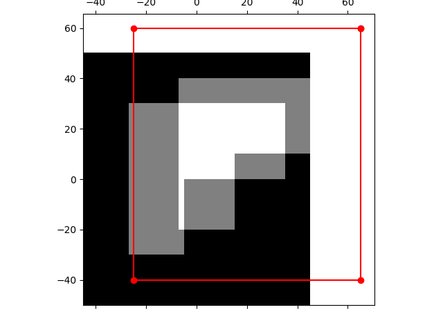
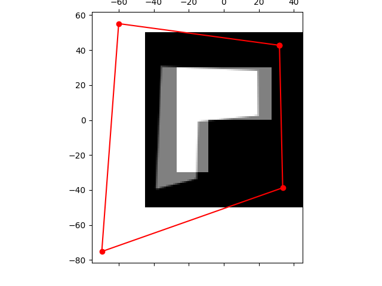

# Dense Image Alignment

<!-- [](https://pypi.org/project/your-package-name/) -->
<!-- [](https://opensource.org/licenses/MIT) -->

## Overview

dense_image_alignment is a Python library for dense image alignment. For more detail about methodology look at brief [explanation](./docs/materials/Image_Alignment_Dense_methods.pdf) materials.

<!--  -->
<div class="row">
    <p align="center">
        
        
        
    </p>
</div>


## Features

- 🪄 Configure your [CUSTOM](#configure-custom-transformation) warp fucntion.
- Contains implementations for the first order methods:
    - ✅ Forward Additive
    - ❌ Forward Compositional (not implemented yet)
    - ❌ Inverse Compositional (not implemented yet)

- Contains implementations for coordinate transformations:
    - ✅ Translation
    - ✅ Affine
    - ✅ Homography
    - ❌ Reprojection

## Installation

You may clone repo, build package with poetry and install it to your environment with several steps:

1. Clone repository with:
```bash
git clone https://github.com/GerasimovIV/dense_image_aligment
cd dense_image_aligment
```

2. Set up environment and install poetry.
```bash
python3.10 -m venv .venv
pip install poetry
```

3. Build package with poetry:

```bash
poetry build --format=wheel
```

4. Install package using `./dist/dense_image_aligment-0.1.0-py3-none-any.whl` wheel to your environment:
```bash
pip install /path/to/dense_image_aligment-0.1.0-py3-none-any.whl
```

## Get Started

You may look at examples of follow detailed explanation below. Let's start with basic example of using dense methods for image alignment for warp Translation.

1. Importing the necessary processing functions.

```python
import numpy as np
import matplotlib.pyplot as plt

from dense_image_aligment import show_data, image_aligment_method, read_as_grayscale
from dense_image_aligment import save_aligment_progress, read_as_colored, show_data
from dense_image_aligment.transformations import TranslationTransformation
```

2. Prepare the Input and Template images.

```python
def create_simple_L(shape):
    mask = np.zeros(shape, dtype=np.float32)
    mask[shape[0] // 5 : shape[0] * 4 // 5, shape[1] // 5 : shape[0] * 2 // 5] = 1.
    mask[shape[0] // 2 : shape[0] * 4 // 5, shape[1] // 5 : shape[0] * 4 // 5] = 1.

    return mask


template = create_simple_L([100, 90])
image = create_simple_L([100, 90])

```

3. Define method that you want to use and its hyperparameters.

```python3
method, params = image_aligment_method(key='forward_additive')
params['alpha'] = 1.0
params['max_iterations'] = 100
params['p_init'] = np.array([20., 10.])
params['convergence_threshold'] = 1e-8

transform = TranslationTransformation(params['p_init'])
```

The function image_aligment_method return reference for choisen method function and the set of its default hyperparameters. In that case we have the set of params:

- p_init:
$`\begin{bmatrix} 20. \\ 10 \end{bmatrix}`$
- max_iterations: 100
- convergence_threshold: 1e-8
- verbose: True
- alpha: 1.0

About all this parameters you can read the docs of function through the `help` like

```python
help(method)
```

4. Check the initial warp parameters wih `show_data` function

```python
show_data(
    image=image,
    template=template,
    coords_transform=transform
)
```

And you will see how the parameters warp image over template


5. Run the method on our images.

```python
ps = method(
    image=image,
    template=template,
    coord_transform=transform,
    **params
)
```

Here `ps` is a List of estimated parameters on each iteration.

7. To look at the process of alignmet we provide function that write the results of alignment on each step.

```python
save_aligment_progress(
    f'../docs/images/translation_alignment_example.gif',
    image=image,
    template=template,
    coords_transform=transform,
    ps=ps,
    duration=100,
)
```


8. To look only at result we provide the function `show_data`.

```python
transform.p = ps[-1]

show_data(
    image=image,
    template=template,
    coords_transform=transform
)
```


### Configure Custom Transformation

After you install the package, let's see the example of usage for general case of Image Transformation. For now you may use prepared [warp Affine](./notebooks/TranslationExample.ipynb) and basic [warp Translation](./notebooks/TranslationExample.ipynb).

1. First we need to configure our Transformation. To do that we provide class `BaseTransform`. You need to provide implementation for `jacobian()` and `apply_transformation_to_coordinates()`.

```python
from dense_image_aligment.transformations import BaseTransform
import numpy as np


class CustomTransform(BaseTransform):

    def jacobian(self, x: np.array, p_c: np.ndarray) -> np.ndarray:
        """_summary_

        Args:
            x (ndarray): N x 2 matrix of coordinates
            p_c (ndarray): n vector of parameters

        Returns:
            ndarray: N x 2 x n
        """

        # you code here #

    def apply_transformation_to_coordinates(self, coords: np.ndarray) -> np.ndarray:
        """apply transformation to image coordinates

        Args:
            coords (np.ndarray): N x 2 matrix (x, y coordinates)

        Returns:
            np.ndarray: transformed coordinates N x 2 matrix
        """
        # you code here #

```
