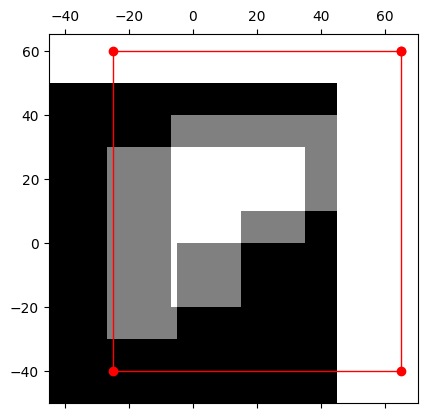
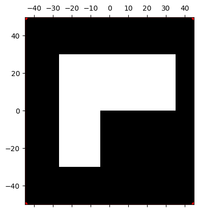

# Dense Image Alignment

<!-- [](https://pypi.org/project/your-package-name/) -->
<!-- [](https://opensource.org/licenses/MIT) -->

## Overview

dense_image_alignment is a Python library for dense image alignment. For more detail about methodology look at brief [explanation](./docs/materials/Image_Alignment_Dense_methods.pdf) materials.

<!--  -->

## Features

- This package contains an implementation for [affine](https://docs.opencv.org/3.4/d4/d61/tutorial_warp_affine.html) image transformation.
- Contains implementations for the first order methods:
    - Forward Additive
    - Forward Compositional
    - Inverse Compositional

## Installation

You may clone repo, build package with poetry and install it to your environment with several steps:

1. Clone repository with:
```bash
git clone https://github.com/GerasimovIV/dense_image_aligment
cd dense_image_aligment
```

2. Set up environment and install poetry.
```bash
python3.10 -m venv .venv
pip install poetry
```

3. Build package with poetry:

```bash
poetry build --format=wheel
```

4. Install package using `./dist/dense_image_aligment-0.1.0-py3-none-any.whl` wheel to your environment:
```bash
pip install /path/to/dense_image_aligment-0.1.0-py3-none-any.whl
```

## Get Started

After you install the package, let's see the example of usage.

1. Importing the necessary processing functions.

```python
from dense_image_aligment import show_data, image_aligment_method, read_as_grayscale
from dense_image_aligment import save_aligment_progress, read_as_colored, show_data
import numpy as np
```

2. Read the Input and Template images.

```python
image = read_as_grayscale('./media/kanade_image.jpg')
templ = read_as_grayscale('./media/kanade.jpg')
```

3. As was shown in [introductory materials](./docs/materials/Image_Alignment_Dense_methods.pdf) dense methods depends from noise and in order to get a good convergence to the local minimum, it is necessary to remove noise as much as possible. We propose to do that with opencv utility, but now for the example the step with denoising is skipped.

4. Let's define method that we want to use and its hyperparameters.

```python3
method, params = image_aligment_method(key='forward_additive')
params['alpha'] = 1.0
params['max_iterations'] = 500
params['p_init'] = np.array(
    [
        [1, 0.1, 40],
        [0.2, 1., 70.],
    ]
)
```

The function image_aligment_method return reference for choisen method function and the set of its default hyperparameters. In that case we have the set of params:

- p_init:
$`\begin{bmatrix} 1. & 0.1& 40. \\ 0.2 & 1. & 70. \end{bmatrix}`$
- max_iterations: 500
- convergence_threshold: 0.0001
- verbose: True
- alpha: 0.1

About all this parameters you can read the docs of function through the `help` like

```python
help(method)
```

5. Check the initial warp parameters wih `show_data` function

```python
show_data(
    image=image,
    template=templ,
    mat_affine=params['p_init']
)
```

And you will see how the parameters warp image over template



6. Run the method on our images.

```python
ps = method(
    image=image,
    template=templ,
    **params
)
```

Here `ps` is a List of estimated parameters (for [affine](https://docs.opencv.org/3.4/d4/d61/tutorial_warp_affine.html) image transformation) on each iteration.

7. To look at the process of alignmet we provide function that write the results of alignment on each step.

```python
save_aligment_progress(
    f'./media/progress_example.gif',
    image=image,
    template=templ,
    mat_affine_list=ps,
    duration=100,
)
```


8. To look only at result we provide the function `show_data`.

```python
show_data(
    image=image,
    template=templ,
    mat_affine=ps[-1]
)
```

